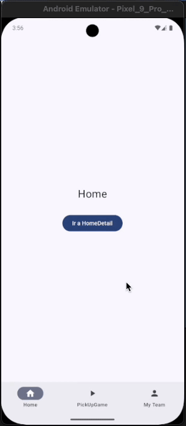

# Jetpack Compose Multi-Backstack Navigation (Play Store-style)

This project implements a custom multi-backstack navigation system using **Jetpack Compose Navigation 3**. It replicates the tab navigation behavior seen in apps like the **Google Play Store**, where:

- Each bottom tab has its **own independent backstack**.
- Navigating within a tab does **not affect other tabs**.
- Tapping the current bottom tab **pops to the root** of that tab.
- The **back button respects tab history**, and exits the app when all history is consumed.

---

## 📱 Demo (GIF or Screenshot)

---

## 🔧 Key Features

✅ Multi-backstack support with separate navigation stacks per tab  
✅ `popToRoot()` behavior when re-tapping the active tab  
✅ Tab history tracking for proper back navigation  
✅ Fully compatible with Navigation 3 and Compose idioms  
✅ No external libraries — pure Compose and Kotlin logic

---

## 🧠 How It Works

- Each `BottomNavItem` maintains a mutable list of `NavKey` objects (your screen identifiers).
- A central `currentTab` state tracks which tab is active.
- When navigating within a tab, entries are pushed onto that tab's backstack.
- When switching tabs:
    - The current tab is pushed to a tab history list.
    - The target tab becomes active and resumes its last screen.
- When the back button is pressed:
    - If there are entries in the current backstack → pop one.
    - Else if there’s tab history → switch to the previous tab.
    - Else → exit the app.

---

## ✨ Example Navigation Flow

1. User starts in `Home`
2. Navigates: `Home` → `HomeDetail`
3. Switches to `MyTeam` tab → `Home` is added to tab history
4. Switches to `PickUpGame` tab → `MyTeam` is added to tab history
5. Navigates: `PickUpGame` → `PickUpGameDetail`
6. Taps again on `PickUpGame` tab → backstack is cleared to `PickUpGame` root
7. Presses back → returns to `MyTeam`
8. Presses back again → returns to `HomeDetail`
9. Presses back → exits the app

---

## 📂 Project Structure Highlights

- `BottomNavItem`: sealed interface for tab definition with icon/title.
- `NavKey`: interface for screen entries.
- `rememberTabsBackStacks(...)`: initializes tab backstacks and current tab state.
- `switchTab(...)`: handles tab changes and pop-to-root logic.
- `popToRoot(...)`: clears a tab's backstack down to its root.
- `NavDisplay(...)`: renders the current screen stack.

---

## 🤔 Why This Implementation?

This implementation provides a practical multi-backstack solution that addresses current limitations in Navigation 3. It serves as an effective approach until official support becomes available.

---

## 📥 Feedback and Contributions

This is an evolving approach given Navigation 3’s ongoing development. Contributions, issues, or suggestions are welcome!

---

## 📄 License

This project is licensed under the [MIT License](LICENSE).